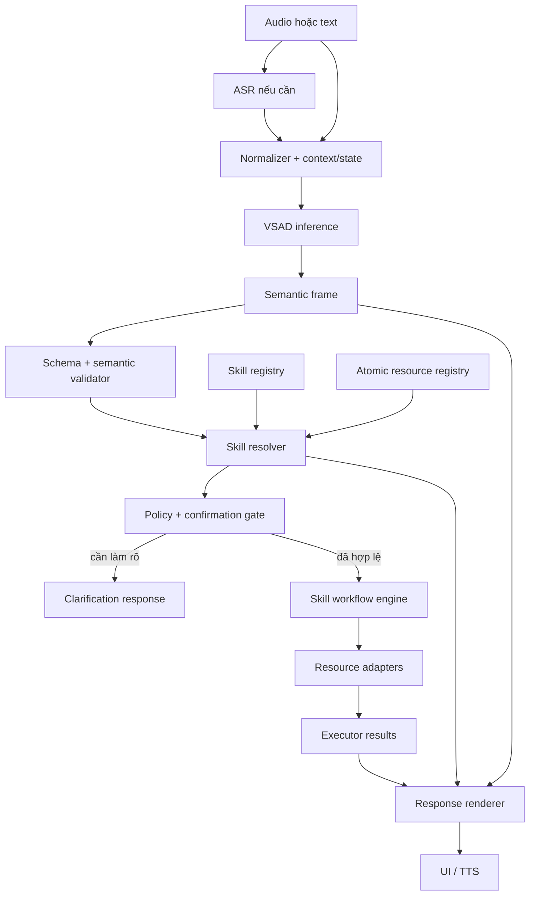

# Đặc tả tổng thể — Local Voice AI Assistant

## 1. Mục đích

Tài liệu định nghĩa kiến trúc, contract và ranh giới trách nhiệm của Local Voice AI Assistant. Hệ thống nhận lời nói hoặc văn bản, suy luận semantic frame bằng VSAD, lựa chọn workflow phù hợp và điều phối các tài nguyên local để đáp ứng yêu cầu.

Ba khái niệm trung tâm:

- **Model** hiểu ý định ổn định và sinh semantic output.
- **Resource** là operation nguyên tử đã được application cung cấp và runtime có thể gọi trực tiếp.
- **Skill** là workflow điều phối một hoặc nhiều resource để hoàn thành mục tiêu người dùng.

Chi tiết yêu cầu nằm trong `02_FunctionRequiment.md`; định hướng xây skill nằm trong `Skills.md`.

## 2. Phạm vi hệ thống

### 2.1. Trong phạm vi

- Nhận text trực tiếp hoặc text từ ASR.
- Quản lý context, dialogue state và pending action.
- Suy luận `act`, `goal`, typed `parameters` và `response_text` bằng VSAD.
- Validate semantic frame tại trust boundary.
- Tra cứu resource và skill local.
- Resolve ứng dụng, media, website và entity động.
- Hỏi làm rõ khi thiếu hoặc mơ hồ.
- Xác nhận hành động nhạy cảm.
- Điều phối workflow skill và resource adapter.
- Tạo phản hồi trước/sau execution.
- Phát phản hồi qua UI hoặc TTS.
- Hoạt động local không bắt buộc kết nối Internet.

### 2.2. Ngoài phạm vi của VSAD

VSAD không trực tiếp:

- thu âm microphone;
- chạy ASR hoặc TTS;
- xác minh ứng dụng/resource đang tồn tại;
- chọn executable path hoặc API adapter;
- thực thi command;
- sinh raw shell command;
- quản lý quyền hệ điều hành;
- xác nhận execution thành công;
- quyết định policy an toàn cuối cùng.

Các trách nhiệm này thuộc runtime và resource adapter.

## 3. Cấu trúc thư mục cấp cao

```text
AL_voice_local/
├── Docs/                         # Tài liệu hệ thống
├── Runtime/
│   ├── Model/
│   │   └── VSAD/<version>/       # Package model dùng cho inference
│   ├── Registry/                 # Resource và skill manifests
│   ├── Skills/                   # Workflow definitions
│   └── Adapters/                 # Resource executors
└── Application/                  # UI, orchestration và integration
```

Workspace huấn luyện/đánh giá model là một project độc lập. Application chỉ phụ thuộc package inference đã phát hành, không phụ thuộc notebook, dataset hoặc training checkpoint.

Package VSAD runtime tuân theo contract:

```text
config.json
tokenizer.json
VSAD.safetensors
requirements.txt
```

## 4. Thuật ngữ và ownership

| Thành phần | Định nghĩa | Owner |
|---|---|---|
| `ACT` | Hành vi hội thoại: execute, hỏi lại, xác nhận, hủy, trả lời hoặc từ chối | Model; runtime kiểm tra policy |
| `GOAL` | Nhóm mục tiêu semantic ổn định | Model |
| `parameters` | Tham số typed hoặc raw input span | Model; runtime validate/resolve |
| `response_text` | Phản hồi ứng viên do model sinh | Model |
| Resource | Operation nguyên tử application có thể cung cấp và runtime gọi trực tiếp | Runtime registry |
| Skill | Workflow dùng resource để hoàn thành mục tiêu | Runtime skill engine |
| Adapter | Implementation local của resource contract | Runtime |
| Executor result | Kết quả quan sát được sau execution | Runtime |

Skill không phải model label, Python module, executable hoặc resource. Thêm skill/resource không mặc nhiên yêu cầu retrain VSAD.

## 5. Kiến trúc logic



## 6. VSAD semantic contract

### 6.1. Public inference output

```json
{
  "act": "EXECUTE",
  "goal": "APPLICATION_CONTROL",
  "parameters": {
    "action": "OPEN",
    "application": {
      "source": "input_span",
      "start": 3,
      "end": 9,
      "value": "Hermes"
    }
  },
  "response_text": "Tôi sẽ mở Hermes."
}
```

Runtime không yêu cầu model sinh `skill_id`, `resource_id`, executable path hoặc shell command. Runtime dùng semantic frame và raw input để resolve workflow phù hợp.

### 6.2. ACT ontology

| ACT | Ý nghĩa | Dispatch trực tiếp |
|---|---|:---:|
| `EXECUTE` | Người dùng yêu cầu một hành động | Chỉ sau runtime validation |
| `ASK_CLARIFICATION` | Cần bổ sung hoặc xác nhận thông tin | Không |
| `CONFIRM` | Người dùng xác nhận pending action ở lượt tiếp theo | Không tự thân; runtime resolve pending frame |
| `CANCEL` | Hủy pending action | Không |
| `RESPOND` | Phản hồi không side effect | Không |
| `UNSUPPORTED` | Yêu cầu ngoài contract hoặc không thể xử lý an toàn | Không |

### 6.3. GOAL và parameter contract

| GOAL | Parameters |
|---|---|
| `APPLICATION_CONTROL` | `action: OPEN/CLOSE/FOCUS`, `application: dynamic` |
| `MEDIA_CONTROL` | `action`, optional `query`, `platform`, `volume` |
| `WEB_OPEN` | `target`, optional `browser` |
| `WEB_SEARCH` | `query`, optional `engine` |
| `WEB_NAVIGATE` | `action`, optional `amount` |
| `TAB_CONTROL` | `action`, optional `tab_index`, `tab_reference` |
| `RUN_COMMAND` | allowlisted `command_id`, typed `arguments` |
| `TASK_STATUS` | optional `scope` |
| `SOCIAL_RESPONSE` | `intent` |

Dynamic parameter dùng một trong hai nguồn:

```json
{"source": "input_span", "start": 3, "end": 9, "value": "Hermes"}
```

```json
{"source": "state_reference", "path": "state.current_target_application"}
```

Runtime phải kiểm tra span, path allowlist, required fields và type trước khi routing.

## 7. Resource contract

Resource là operation nhỏ nhất mà runtime có thể gọi. Một public resource ID biểu diễn đúng một operation, theo dạng `<domain>.<component>.<operation>`. Ví dụ:

- application discovery;
- process launch/close;
- window focus;
- media search/playback;
- browser open/search/navigation/tab;
- system command;
- dialogue state;
- confirmation store;
- task status;
- response rendering;
- ASR/TTS.

Resource manifest tối thiểu:

```json
{
  "resource_id": "application.control.open",
  "description": "Mở một ứng dụng local đã resolve",
  "arguments": {"application_id": "string"},
  "result": {"ok": "boolean", "application_id": "string", "error": "string|null"},
  "risk": "LOW",
  "enabled": true
}
```

Quy tắc:

- Registry là source of truth cho resource hiện có.
- Mỗi resource có schema typed, risk và availability.
- Model không quyết định resource có tồn tại.
- Adapter chỉ nhận arguments đã validate.
- Resource không chứa workflow nghiệp vụ nhiều bước.

## 8. Skill contract

Skill là workflow khai báo:

```text
trigger/intent compatibility
→ required resources
→ argument resolution
→ ordered steps
→ policy and confirmation
→ result aggregation
→ response mapping
```

Ví dụ:

```json
{
  "skill_id": "application.open",
  "description": "Resolve và mở một ứng dụng local",
  "accepts": {
    "goal": "APPLICATION_CONTROL",
    "action": "OPEN"
  },
  "inputs": {
    "application": {"type": "string", "required": true}
  },
  "resources": ["application.catalog.resolve", "application.control.open"],
  "steps": [
    {"use": "application.catalog.resolve", "with": {"query": "$application"}},
    {"use": "application.control.open", "with": {"application": "$resolved"}}
  ],
  "risk": "LOW"
}
```

Skill resolver có thể dùng exact alias, normalized token matching, fuzzy matching và optional local embeddings. Không bắt buộc Internet.

## 9. Safety policy

### 9.1. Dispatch gate

Runtime chỉ dispatch khi:

1. semantic frame hợp schema;
2. ACT cho phép xử lý;
3. skill tương thích GOAL/action;
4. required inputs đầy đủ;
5. entity resolve duy nhất;
6. mọi resource enabled;
7. arguments đúng type và allowlist;
8. risk policy đã được thỏa mãn.

Mọi lỗi tại trust boundary phải fail closed.

### 9.2. System command policy

```text
SHUTDOWN_SYSTEM → yêu cầu xác nhận và lưu pending frame
RESTART_SYSTEM  → yêu cầu xác nhận và lưu pending frame
SLEEP_SYSTEM    → có thể execute sau validation thông thường
```

`CONFIRM` chỉ có ý nghĩa khi runtime đang giữ pending frame hợp lệ. Pending action phải hết hạn và được validate lại trước dispatch.

### 9.3. Shell boundary

- Không thực thi raw shell do model hoặc người dùng tạo trực tiếp.
- `RUN_COMMAND` chỉ map tới command ID trong allowlist.
- Shell/API implementation chỉ tồn tại trong trusted adapter.
- Credential và secret không được ghi vào model input, logs hoặc skill manifest.

## 10. Response ownership

| Phase | Nguồn phản hồi | Quy tắc |
|---|---|---|
| Semantic/pre-execution | VSAD hoặc runtime renderer | Không tuyên bố thành công |
| Clarification | Runtime dựa trên missing/ambiguous inputs | Nêu rõ thông tin cần bổ sung |
| Confirmation | Runtime policy renderer | Nêu action và risk cần xác nhận |
| Post-execution | Runtime từ executor result | Chỉ tuyên bố kết quả đã quan sát |

`response_text` của VSAD là response ứng viên. Runtime được phép thay bằng grounded response dựa trên resolved entity, skill và executor result. Response text không được dùng để chọn command hoặc bypass semantic validation.

## 11. Local retrieval

Local retrieval dùng dữ liệu trong registry/catalog:

```text
exact alias
→ normalized token match
→ fuzzy match
→ optional local embedding
```

Ngưỡng chọn phải xét cả top score và khoảng cách top-1/top-2. Không đủ chắc chắn thì hỏi lại. RAG/retrieval hỗ trợ resolve entity, resource help và response grounding; không thay thế ACT/GOAL, schema hoặc safety policy.

## 12. Runtime state

Runtime state tối thiểu:

```json
{
  "active_application": null,
  "active_browser": null,
  "active_url": null,
  "active_media": null,
  "pending_action": null,
  "last_task": null,
  "active_task": null
}
```

State path model có thể tham chiếu phải được allowlist. Skill chỉ đọc/ghi state qua runtime API, không chỉnh object tùy ý.

## 13. Extensibility rules

- Thêm app: thêm resource/catalog entry hoặc adapter; không thêm model class.
- Thêm operation cho app: đăng ký resource nguyên tử mới và adapter.
- Thêm workflow: thêm skill dùng resource hiện có.
- Thêm semantic family mới: cập nhật ontology/model/data khi GOAL hiện có không biểu diễn được.
- Thay executable/API: sửa adapter hoặc registry, không sửa skill semantics.
- Tắt chức năng: `enabled=false`; không tái sử dụng ID cho nghĩa khác.

## 14. Verification contract

Mỗi release application phải kiểm tra:

- model package clean-load;
- semantic schema validation;
- resource/skill manifest validation;
- skill-resource dependency resolution;
- no raw-shell path từ model output;
- ambiguous resolution fail closed;
- confirmation lifecycle;
- adapter result mapping;
- grounded post-execution response;
- end-to-end tests cho từng skill được enable.
