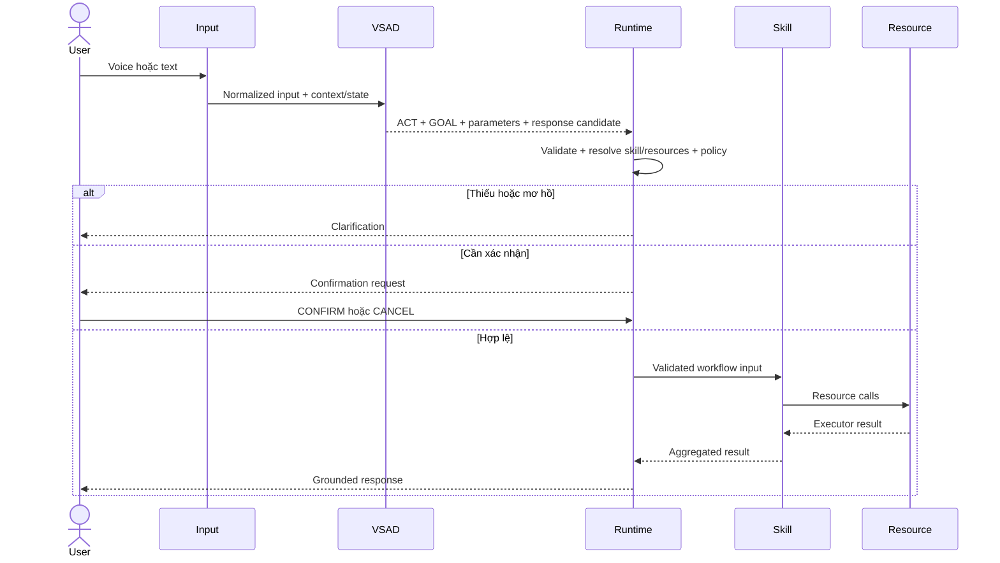

# Yêu cầu chức năng — Local Voice AI Assistant

## 1. Mục đích

Tài liệu định nghĩa yêu cầu chức năng và phi chức năng của toàn application. Ranh giới kiến trúc nằm trong `01_Specìication.md`; resource/skill catalog và quy tắc xây workflow nằm trong `Skills.md`.

## 2. Tác nhân và thành phần

| Tác nhân/thành phần | Trách nhiệm |
|---|---|
| User | Gửi yêu cầu, bổ sung thông tin, xác nhận hoặc hủy |
| Input layer | Thu text trực tiếp hoặc từ ASR |
| VSAD | Sinh ACT, GOAL, typed parameters và response candidate |
| Runtime orchestrator | Validate, resolve skill/resource, enforce policy và quản lý state |
| Skill engine | Thực thi workflow đã khai báo |
| Resource adapter | Cung cấp operation nguyên tử local |
| Response layer | Ground response và chuyển tới UI/TTS |

## 3. Luồng chức năng chuẩn



## 4. Yêu cầu input và model inference

| ID | Yêu cầu | Tiêu chí nghiệm thu |
|---|---|---|
| `FR-IN-001` | Hệ thống MUST nhận text trực tiếp | Chuỗi không rỗng được chuyển vào pipeline |
| `FR-IN-002` | Hệ thống MUST nhận text từ ASR qua cùng normalized contract | Downstream không phụ thuộc ASR provider |
| `FR-IN-003` | Input MUST hỗ trợ context, state và metadata | Serializer tạo input hợp lệ cho VSAD |
| `FR-IN-004` | Input vượt giới hạn MUST bị reject hoặc truncate theo policy công khai | Không silently mất phần current request |
| `FR-MDL-001` | Runtime MUST load package VSAD từ `Runtime/Model/VSAD/<version>` | Config, tokenizer và weights tương thích; clean inference thành công |
| `FR-MDL-002` | VSAD output MUST có `act`, `goal`, `parameters`, `response_text` | Output parse được và đủ field |
| `FR-MDL-003` | ACT/GOAL MUST thuộc ontology package | Giá trị ngoài ontology không được qua trust boundary |
| `FR-MDL-004` | Dynamic input span MUST khớp raw text | `text[start:end] == value` |
| `FR-MDL-005` | State reference MUST thuộc allowlist | Path ngoài allowlist bị từ chối |
| `FR-MDL-006` | Runtime MUST không yêu cầu model sinh skill/resource/executable ID | Routing dùng registry ngoài model |

## 5. Yêu cầu semantic behavior

| ID | Yêu cầu | Tiêu chí nghiệm thu |
|---|---|---|
| `FR-SEM-001` | `EXECUTE` biểu diễn ý định hành động, không phải quyền dispatch | Mọi EXECUTE vẫn đi qua runtime gate |
| `FR-SEM-002` | `ASK_CLARIFICATION` MUST không tạo side effect | Runtime chỉ tạo câu hỏi bổ sung |
| `FR-SEM-003` | `CONFIRM` MUST resolve pending action hiện hữu | Không có pending frame thì không execute |
| `FR-SEM-004` | `CANCEL` MUST hủy pending action phù hợp | Pending state được xóa; không dispatch |
| `FR-SEM-005` | `RESPOND` MUST không gọi resource có side effect | Chỉ response workflow được chạy |
| `FR-SEM-006` | `UNSUPPORTED` MUST fail closed | Không skill execution |
| `FR-SEM-007` | Hệ thống MUST hỗ trợ VI, EN và MIXED theo cùng schema | Không thay contract theo ngôn ngữ |
| `FR-SEM-008` | Nhiễu ASR hoặc ambiguity MUST được xử lý an toàn | Hỏi lại hoặc từ chối; không đoán command nguy hiểm |

## 6. Yêu cầu resource registry

| ID | Yêu cầu | Tiêu chí nghiệm thu |
|---|---|---|
| `FR-RES-001` | Mỗi resource MUST có `resource_id` ổn định | ID duy nhất trong registry |
| `FR-RES-002` | Mỗi resource MUST công bố typed argument schema | Invalid/missing arguments bị reject |
| `FR-RES-003` | Resource MUST công bố risk và availability | Policy gate đọc được hai giá trị |
| `FR-RES-004` | Resource registry MUST là source of truth | Không duplicate resource schema trong skill/model |
| `FR-RES-005` | Resource disabled MUST không được gọi | Dependency resolution fail closed |
| `FR-RES-006` | Adapter MUST chỉ nhận validated arguments | Không nhận raw model envelope hoặc raw user shell |
| `FR-RES-007` | Resource result MUST dùng contract chung | Có `ok`, resource ID, resolved data và error |
| `FR-RES-008` | Thêm resource/app MUST không bắt buộc retrain model | Registry/adapter addition không đổi VSAD contract |
| `FR-RES-009` | Registry MUST là whitelist/config authority cho capability | Missing hoặc `enabled=false` trả `UNSUPPORTED` |
| `FR-RES-010` | Skill/resource code MUST không tự mở rộng whitelist | Không tự thêm app/browser/provider ngoài registry |
| `FR-RES-011` | Capability chưa hỗ trợ MAY tạo câu hỏi opt-in | Hỏi có muốn thêm whitelist; không ghi registry hoặc dispatch tự động |

Resource result mẫu:

```json
{
  "ok": true,
  "resource_id": "application.control.open",
  "resolved": {"application": "Hermes"},
  "error": null
}
```

## 7. Yêu cầu skill workflow

| ID | Yêu cầu | Tiêu chí nghiệm thu |
|---|---|---|
| `FR-SKL-001` | Skill MUST là workflow, không phải resource | Manifest có steps và resource dependencies |
| `FR-SKL-002` | Skill MUST khai báo semantic compatibility | Có GOAL/action/ACT điều kiện phù hợp |
| `FR-SKL-003` | Skill MUST khai báo typed input | Required/type validation chạy trước steps |
| `FR-SKL-004` | Skill MUST chỉ tham chiếu resource có trong registry | Missing dependency chặn enable/load |
| `FR-SKL-005` | Skill MUST khai báo ordered workflow steps | Runtime thực thi đúng thứ tự hoặc dependency graph |
| `FR-SKL-006` | Skill MUST khai báo risk/confirmation rule | Runtime áp dụng trước side effect |
| `FR-SKL-007` | Skill MUST aggregate executor results | Không coi call đã gửi là success |
| `FR-SKL-008` | Skill MUST map result sang response phase phù hợp | Pre/success/failure được phân biệt |
| `FR-SKL-009` | Thêm skill dùng resource hiện có MUST không bắt buộc retrain model | Registry load và routing test đủ |
| `FR-SKL-010` | Skill ID MUST không chứa implementation detail | Không dùng path/module/class làm public ID |
| `FR-SKL-011` | Skill implementation MAY nhóm nhiều workflow cùng domain trong một class | Mỗi method map tới `skill_id` độc lập |
| `FR-SKL-012` | `Skills/<Family>/Skill.md` MUST chỉ là human-readable contract | Runtime không parse Markdown để cấp capability |
| `FR-SKL-013` | Skill MUST tuân capability whitelist từ Registry | Keyword/docs không override missing/disabled entry |

## 8. Yêu cầu skill resolution

| ID | Yêu cầu | Tiêu chí nghiệm thu |
|---|---|---|
| `FR-RTE-001` | Runtime MUST lọc skill theo ACT/GOAL/action | Skill không tương thích không vào candidate set |
| `FR-RTE-002` | Resolver MUST dùng raw input cùng semantic frame | Span sai không phải nguồn duy nhất để resolve |
| `FR-RTE-003` | Resolver MUST hỗ trợ exact alias | Alias chính xác resolve deterministic |
| `FR-RTE-004` | Resolver MUST hỗ trợ normalized matching | Case, NFC và khoảng trắng không làm mất match |
| `FR-RTE-005` | Resolver MAY dùng fuzzy/local embedding | Không bắt buộc Internet |
| `FR-RTE-006` | Candidate mơ hồ MUST dẫn tới clarification | Top score thấp hoặc margin thấp không dispatch |
| `FR-RTE-007` | Không có candidate MUST dẫn tới unsupported | Không fallback raw shell hoặc resource ngẫu nhiên |
| `FR-RTE-008` | Runtime availability MUST được xét khi chọn skill | Disabled/unavailable resource bị loại |
| `FR-RTE-009` | Explicit target ngoài whitelist MUST không fallback | Trả `UNSUPPORTED`, nêu target chưa hỗ trợ |
| `FR-RTE-010` | Runtime MAY hỏi user có muốn thêm target vào whitelist | Câu hỏi không tự thay đổi Registry hoặc tạo side effect |

## 9. Yêu cầu dialogue và confirmation

| ID | Yêu cầu | Tiêu chí nghiệm thu |
|---|---|---|
| `FR-DLG-001` | Runtime MUST lưu pending frame cho hành động cần xác nhận | Frame chứa skill, arguments, risk và expiry |
| `FR-DLG-002` | Shutdown/restart MUST yêu cầu confirmation | Turn đầu không dispatch |
| `FR-DLG-003` | Sleep MAY execute sau validation thông thường | Không bị policy shutdown/restart áp dụng nhầm |
| `FR-DLG-004` | Confirmation MUST là turn riêng | Cụm “không cần hỏi lại” trong request đầu không bypass policy |
| `FR-DLG-005` | Pending frame MUST hết hạn | CONFIRM muộn không execute frame stale |
| `FR-DLG-006` | Pending frame MUST được revalidate | Registry/policy thay đổi có thể chặn execution |
| `FR-DLG-007` | CANCEL MUST xóa đúng pending frame | Không ảnh hưởng task không liên quan |

## 10. Yêu cầu response

| ID | Yêu cầu | Tiêu chí nghiệm thu |
|---|---|---|
| `FR-RSP-001` | Model response MUST được coi là candidate | Không điều khiển routing hoặc execution |
| `FR-RSP-002` | Runtime MUST có grounded renderer | Dùng resolved entity, skill và result thật |
| `FR-RSP-003` | Pre-execution response MUST không tuyên bố thành công | Chỉ mô tả dự định hoặc yêu cầu xác nhận |
| `FR-RSP-004` | Post-execution response MUST dựa trên executor result | Success/failure khớp observed result |
| `FR-RSP-005` | Response MUST không tự thêm entity ngoài validated data | Entity hallucination bị chặn hoặc thay renderer |
| `FR-RSP-006` | Clarification MUST nêu thông tin còn thiếu/mơ hồ | User biết cần trả lời gì |
| `FR-RSP-007` | Response MAY được chuyển sang TTS | TTS không thay semantic contract |

## 11. Skill catalog chức năng

Danh mục canonical của project:

| Skill ID | Mục tiêu | Resources chính |
|---|---|---|
| `application.open` | Resolve và mở ứng dụng | application catalog, application control |
| `application.close` | Resolve và đóng ứng dụng | application catalog, application control |
| `application.focus` | Resolve và focus cửa sổ | application catalog, window control |
| `media.play` | Resolve và phát media | media catalog, media playback |
| `media.transport` | Pause/resume/stop/next/previous | media playback |
| `media.volume` | Tăng/giảm/đặt âm lượng | audio volume |
| `web.open` | Resolve và mở URL/site | browser state, browser navigation |
| `web.search` | Tìm kiếm query bằng engine đã resolve | browser search/navigation |
| `web.navigate` | Back/forward/refresh/scroll/home | browser navigation |
| `tab.manage` | New/close/switch/reopen tab | browser tabs/state |
| `system.command` | Chạy built-in command allowlisted | system command, confirmation store |
| `task.status` | Báo task gần nhất/đang chạy | task store |
| `conversation.social` | Greeting/thanks/goodbye/acknowledgement | response renderer |

Clarification, confirmation và cancellation là runtime control flow, không phải skill. Contract chi tiết và hướng xây từng skill nằm trong `Skills.md`.

## 12. Yêu cầu phi chức năng

### 12.1. Local-first

| ID | Yêu cầu | Tiêu chí nghiệm thu |
|---|---|---|
| `NFR-LOC-001` | Core inference/routing MUST hoạt động offline | Tắt mạng vẫn xử lý skill local |
| `NFR-LOC-002` | Registry và index MUST lưu local | Không cần cloud registry |
| `NFR-LOC-003` | External service MUST được khai báo explicit | Skill không tự gửi dữ liệu ra mạng |

### 12.2. Safety và privacy

| ID | Yêu cầu | Tiêu chí nghiệm thu |
|---|---|---|
| `NFR-SAF-001` | Trust boundaries MUST fail closed | Parse/schema/policy fail không dispatch |
| `NFR-SAF-002` | Raw shell từ model/user MUST bị cấm | Chỉ command ID allowlisted đi vào adapter |
| `NFR-SAF-003` | Logs MUST redact secrets | Không credential/token/password plaintext |
| `NFR-SAF-004` | Resource MUST chạy với quyền tối thiểu | Adapter không yêu cầu privilege ngoài resource |
| `NFR-SAF-005` | Side effects MUST traceable | Log request, selected skill, resource calls và result |

### 12.3. Maintainability

| ID | Yêu cầu | Tiêu chí nghiệm thu |
|---|---|---|
| `NFR-MNT-001` | Model, resource và skill contracts MUST versioned | Incompatible version bị chặn |
| `NFR-MNT-002` | Mỗi schema MUST có một authority | Không duplicate giữa manifest/code/docs |
| `NFR-MNT-003` | Skill/resource manifests MUST validate khi load | Invalid manifest không enable |
| `NFR-MNT-004` | Adapter implementation MAY thay đổi mà giữ public contract | Skill không phụ thuộc path/class nội bộ |
| `NFR-MNT-005` | Registry MUST là machine-readable authority; Skill.md là documentation | Conflict được xử lý theo Registry và docs phải đồng bộ |

### 12.4. Performance

| ID | Yêu cầu | Tiêu chí nghiệm thu |
|---|---|---|
| `NFR-PER-001` | Routing local MUST bounded theo registry size | Có top-k/filter trước expensive retrieval |
| `NFR-PER-002` | Context MUST bounded | Không tăng memory vô hạn theo số turn |
| `NFR-PER-003` | Resource call MUST có timeout/cancellation | Workflow không treo vô hạn |

### 12.5. Testability

| ID | Yêu cầu | Tiêu chí nghiệm thu |
|---|---|---|
| `NFR-TST-001` | Mỗi enabled skill MUST có end-to-end test | Input → routing → mocked/real adapter result → response |
| `NFR-TST-002` | Mỗi high-risk skill MUST có policy tests | Initial request, confirm, cancel, expiry, bypass phrase |
| `NFR-TST-003` | Resolver MUST có ambiguity tests | Top-1/top-2 gần nhau không dispatch |
| `NFR-TST-004` | Runtime MUST test model-output adversarial cases | Invalid spans/GOAL/parameters fail closed |

## 13. Acceptance contract

Application đạt functional contract khi:

1. VSAD package clean-load và trả public semantic contract.
2. Resource/skill manifests validate và dependencies resolve.
3. Không model output nào được dispatch trước runtime gate.
4. Skill resolver fail closed với unknown/ambiguous input.
5. Shutdown/restart confirmation lifecycle hoạt động end-to-end.
6. Adapter chỉ nhận typed validated arguments.
7. Post-execution response dựa trên observed result.
8. Từng skill enabled có runnable acceptance check.
9. Core local skills hoạt động khi không có mạng.
