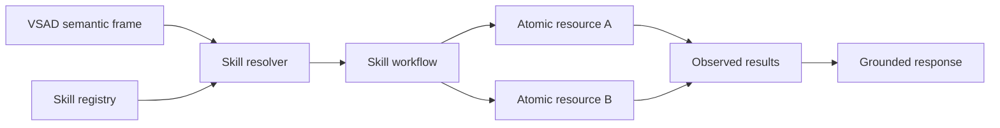

# Skill Design Guide — Local Voice AI Assistant

## 1. Mục đích

Tài liệu là định hướng xây skill cho Local Voice AI Assistant.

Định nghĩa chốt:

> **Resource là operation nguyên tử đã có trong application và runtime có thể gọi trực tiếp; skill là workflow sử dụng một hoặc nhiều resource để hoàn thành mục tiêu người dùng.**

Hệ quả:

- Skill không phải resource ID.
- Skill không phải output class bắt buộc của VSAD.
- Skill không chứa executable path hoặc implementation detail.
- Thêm skill dùng resource hiện có không yêu cầu retrain model.
- Model cung cấp semantic frame; runtime resolve skill.

## 2. Mô hình khái niệm



| Khái niệm | Câu hỏi trả lời | Ví dụ |
|---|---|---|
| GOAL | Người dùng muốn đạt nhóm mục tiêu nào? | `APPLICATION_CONTROL` |
| Generic action | Người dùng muốn thao tác gì? | `OPEN` |
| Resource | Runtime có thể gọi operation nguyên tử nào? | `application.catalog.resolve`, `window.control.focus` |
| Skill | Cần phối hợp các resource theo workflow nào? | `application.open` |

### 2.1. Cấu trúc source và ownership

```text
Skills/<Family>/Skill.md          # human-readable contract
Runtime/Registry/*.json           # whitelist/config authority
Runtime/Skills/<Family>.py        # workflow implementation
Runtime/Resources/<Domain>.py     # atomic operations
```

- `Skill.md` mô tả family, trường hợp dùng, keywords tham khảo, workflow IDs, resources, risk và điều cấm.
- Registry là source of truth mà runtime đọc để quyết định app, browser, provider, alias, resource, `enabled` và config được phép.
- Runtime không parse `Skill.md` để cấp quyền. Khi tài liệu và registry khác nhau, registry thắng và tài liệu phải được đồng bộ.
- Một Python class có thể chứa nhiều workflow methods theo cùng domain; mỗi method vẫn map tới một `skill_id` riêng.
- Mỗi resource method vẫn map tới một public `resource_id` nguyên tử.

Ví dụ:

```text
Runtime/Skills/WebControl.py
class WebControl
  open()       → web.open
  change_tab() → tab.manage

Runtime/Resources/Browser.py
class Browser
  open()       → browser.navigation.open
  switch_tab() → browser.tabs.switch
```

Tên class/file là implementation detail PascalCase; public ID vẫn dùng lowercase dot notation.

## 3. Ranh giới Model và Runtime

### 3.1. Model trả semantic frame

```json
{
  "act": "EXECUTE",
  "goal": "APPLICATION_CONTROL",
  "parameters": {
    "action": "OPEN",
    "application": {
      "source": "input_span",
      "value": "Hermes"
    }
  },
  "response_text": "Tôi sẽ mở Hermes."
}
```

### 3.2. Runtime resolve skill

```text
ACT=EXECUTE
GOAL=APPLICATION_CONTROL
action=OPEN
→ application.open
```

Runtime dùng raw input, semantic frame, state, registry và availability. Model không cần biết `application.open` là ID gì hoặc workflow có bao nhiêu bước.

## 4. Resource catalog

Resource catalog là foundation để build skill. Mỗi hàng là một public resource ID nguyên tử; adapter có thể thay đổi implementation mà không đổi contract.

| Resource ID pattern | Operations nguyên tử |
|---|---|
| `model.vsad.infer` | Inference semantic frame |
| `dialogue.state.<get|set|clear>` | Đọc/ghi/xóa active context |
| `confirmation.store.<create|resolve|cancel|expire>` | Quản lý pending action |
| `application.catalog.<list|resolve>` | Tra cứu application local và aliases |
| `application.control.<open|close>` | Điều khiển process/application |
| `window.control.<list|focus>` | Resolve và focus cửa sổ |
| `media.catalog.<search|resolve>` | Resolve media item |
| `media.playback.<play|pause|resume|stop|next|previous>` | Điều khiển media session |
| `audio.volume.<get|set|increase|decrease>` | Điều khiển âm lượng |
| `browser.state.<active|tabs>` | Đọc browser và tab state |
| `browser.navigation.<open|search|back|forward|refresh|scroll|home>` | Điều hướng web |
| `browser.tabs.<new|close|switch|reopen>` | Quản lý tab |
| `system.command.<lock|shutdown|restart|sleep|screenshot>` | Built-in OS commands allowlisted |
| `task.store.<last|active>` | Truy vấn task state |
| `response.renderer.<pre|clarify|confirm|success|failure>` | Sinh response grounded |
| `speech.asr.transcribe` | Chuyển audio thành text |
| `speech.tts.speak` | Chuyển response thành audio |

Mỗi giá trị được khai triển từ pattern là một resource ID độc lập. Dấu `|` chỉ rút gọn catalog trong tài liệu, không tạo grouped resource ID.

Resource rule:

1. Một resource biểu diễn đúng một operation.
2. Resource arguments và result phải typed.
3. Resource không tự gọi resource khác để tạo workflow ẩn.
4. Availability và risk được công bố trong registry.
5. Adapter không nhận raw shell từ model/user.
6. Resource không tự thêm capability hoặc target ngoài Registry.

### 4.1. Registry whitelist policy

- Entry không tồn tại hoặc `enabled=false` nghĩa là `UNSUPPORTED`.
- Skill chỉ được gọi resource/app/browser/provider đang được registry cho phép.
- Không silently fallback sang browser/provider khác khi user chỉ định target chưa hỗ trợ.
- Runtime được hỏi user có muốn thêm capability vào whitelist, nhưng không được tự ghi registry hoặc dispatch trong cùng bước.
- Keywords trong `Skill.md` chỉ giúp người đọc hiểu trigger; aliases operational nằm trong registry.

Theo registry hiện tại, browser được phép là Chrome, Cốc Cốc và Edge. Firefox chưa được whitelist nên yêu cầu như “mở YouTube bằng Firefox” phải trả `UNSUPPORTED` và hỏi user có muốn thêm Firefox vào whitelist hay không.

## 5. Resource manifest

```json
{
  "resource_id": "application.control.open",
  "version": "1.0",
  "arguments": {
    "application_id": {"type": "string", "required": true}
  },
  "result": {
    "ok": "boolean",
    "application_id": "string",
    "error": "string|null"
  },
  "risk": "LOW",
  "enabled": true
}
```

Không đặt alias tự nhiên của workflow vào resource manifest. Alias/user phrasing thuộc skill resolver hoặc entity catalog.

## 6. Skill manifest

Skill manifest tối thiểu:

```json
{
  "skill_id": "application.open",
  "version": "1.0",
  "description": "Resolve và mở một ứng dụng local",
  "accepts": {
    "act": ["EXECUTE"],
    "goal": "APPLICATION_CONTROL",
    "parameters": {"action": "OPEN"}
  },
  "aliases": ["mở ứng dụng", "bật ứng dụng", "open app"],
  "inputs": {
    "application": {"type": "string", "required": true}
  },
  "resources": [
    "application.catalog.resolve",
    "application.control.open"
  ],
  "steps": [
    {
      "id": "resolve_application",
      "use": "application.catalog.resolve",
      "with": {"query": "$inputs.application"}
    },
    {
      "id": "open_application",
      "use": "application.control.open",
      "with": {"application_id": "$steps.resolve_application.application_id"}
    }
  ],
  "risk": "LOW",
  "confirmation_required": false,
  "response": {
    "pre": "Tôi sẽ mở {application_name}.",
    "success": "Đã mở {application_name}.",
    "failure": "Không thể mở {application_name}: {error}."
  }
}
```

## 7. Quy tắc xây skill

### 7.1. Khi nào tạo skill

Tạo skill khi có một workflow người dùng có thể gọi độc lập và workflow cần:

- semantic compatibility riêng;
- input contract riêng;
- một hoặc nhiều resource calls;
- policy/confirmation riêng;
- response mapping riêng.

Không tạo skill mới khi khác biệt chỉ là dữ liệu:

```text
mở Chrome
mở Hermes
mở Obsidian
```

Cả ba dùng `application.open`; app name là entity từ catalog.

Không tạo skill mới khi khác biệt chỉ là implementation/provider nhưng workflow giống nhau. Provider được resolve bằng resource registry hoặc parameter.

### 7.2. Skill naming

```text
<domain>.<workflow>
```

Ví dụ:

```text
application.open
media.play
tab.manage
system.command
conversation.capabilities
```

Tên skill:

- lowercase dot notation;
- mô tả workflow, không mô tả class/module/path;
- không đổi nghĩa trong cùng major contract;
- skill bị bỏ dùng chuyển `enabled=false`, không tái sử dụng ID.
- không bắt buộc trùng tên Python class/method; class chỉ là implementation container theo domain.

### 7.3. Workflow steps

Mỗi step phải:

- tham chiếu resource đã đăng ký;
- có typed input mapping;
- có timeout/cancellation policy;
- trả structured result;
- không đọc output chưa tồn tại;
- không che lỗi resource.

Skill engine dừng hoặc chạy compensation theo policy manifest; không tự suy đoán success.

### 7.4. Risk

| Risk | Ví dụ | Policy mặc định |
|---|---|---|
| `NONE` | status/help/social response | Không confirmation |
| `LOW` | open app, play media, navigate | Execute sau validation |
| `MEDIUM` | close app, stop task | Có thể clarify/confirm theo state |
| `HIGH` | shutdown, restart, destructive operation | Confirmation turn riêng |

Skill risk không được thấp hơn resource risk cao nhất mà workflow gọi.

## 8. Skill resolution algorithm

```text
1. Reject ACT không cho phép side effect.
2. Filter skill theo GOAL và generic action.
3. Filter theo enabled resources và runtime availability.
4. Match exact aliases/entity catalogs.
5. Match normalized tokens.
6. Match fuzzy text nếu cần.
7. Optional local embedding retrieval nếu catalog lớn.
8. Validate required input coverage.
9. Check top score và top-1/top-2 margin.
10. Chọn duy nhất hoặc ASK_CLARIFICATION/UNSUPPORTED.
```

Resolver phải dùng cả raw input và model frame. Không phụ thuộc duy nhất vào dynamic span vì span có thể thiếu ký tự.

Local embedding là optional optimization; skill system không phụ thuộc mạng.

## 9. Canonical skill catalog

### 9.1. Application skills

| Skill ID | Semantic compatibility | Inputs | Resources | Workflow |
|---|---|---|---|---|
| `application.open` | `APPLICATION_CONTROL/OPEN` | `application` | catalog, application control | resolve app → open |
| `application.close` | `APPLICATION_CONTROL/CLOSE` | `application` | catalog, application control | resolve app → close |
| `application.focus` | `APPLICATION_CONTROL/FOCUS` | `application` | catalog, window control | resolve app → resolve window → focus |

### 9.2. Media skills

| Skill ID | Semantic compatibility | Inputs | Resources | Workflow |
|---|---|---|---|---|
| `media.play` | `MEDIA_CONTROL/PLAY` | optional `query`, `platform` | media catalog, playback | resolve source/item → play |
| `media.transport` | PAUSE/RESUME/STOP/NEXT/PREVIOUS | `action` | media playback | resolve active session → apply action |
| `media.volume` | `MEDIA_CONTROL` volume actions hoặc `RUN_COMMAND/SET_VOLUME` | `action`, optional `volume` | audio volume | normalize command → validate level → apply |

### 9.3. Web and browser skills

| Skill ID | Semantic compatibility | Inputs | Resources | Workflow |
|---|---|---|---|---|
| `web.open` | `WEB_OPEN` | `target`, optional `browser` | browser state/navigation | resolve browser/target → open |
| `web.search` | `WEB_SEARCH` | `query`, optional `engine` | browser navigation | resolve engine → construct safe search → open |
| `web.navigate` | `WEB_NAVIGATE` | `action`, optional `amount` | browser state/navigation | validate active browser → navigate |
| `tab.manage` | `TAB_CONTROL` | `action`, optional tab selector | browser state/tabs | resolve tab if needed → apply action |

### 9.4. System and task skills

| Skill ID | Semantic compatibility | Inputs | Resources | Workflow |
|---|---|---|---|---|
| `system.command` | `RUN_COMMAND` | `command_id`, typed `arguments` | system command, confirmation store | allowlist → confirmation policy → execute |
| `task.status` | `TASK_STATUS` | optional `scope` | task store | query state → render status |

Built-in system command policy:

```text
SHUTDOWN_SYSTEM → HIGH, confirmation required
RESTART_SYSTEM  → HIGH, confirmation required
SLEEP_SYSTEM    → LOW/MEDIUM, normal validation
LOCK_SCREEN     → LOW
TAKE_SCREENSHOT → LOW
SET_VOLUME      → route sang `media.volume`, không thuộc `system.command`
```

### 9.5. Conversation skills

| Skill ID | Semantic compatibility | Inputs | Resources | Workflow |
|---|---|---|---|---|
| `conversation.social` | `RESPOND/SOCIAL_RESPONSE` | `intent` | response renderer | render social response |
Clarification, confirmation và cancellation là runtime control flow, không phải skill. Resource/help query chỉ trở thành skill khi ontology VSAD có semantic route rõ ràng; không route ngầm từ `UNSUPPORTED` hoặc `SOCIAL_RESPONSE`.

## 10. Skill execution envelope

Sau routing và validation:

```json
{
  "skill_id": "media.play",
  "inputs": {
    "query": "playlist Sơn Tùng",
    "platform": "SPOTIFY"
  },
  "resolved": {
    "media_name": "This Is Sơn Tùng M-TP",
    "media_uri": "provider-specific-local-reference"
  },
  "risk": "LOW",
  "confirmation_required": false,
  "request_id": "local-uuid"
}
```

Model không tạo envelope này. Runtime tạo từ validated semantic frame và registry results.

## 11. Response mapping

Skill response sử dụng dữ liệu grounded:

```text
pre       → resolved input, chưa có executor result
clarify   → missing/ambiguous fields
confirm   → pending action + risk
success   → executor result ok=true
failure   → executor result ok=false
```

Không dùng model response để:

- chọn skill;
- chọn executable;
- xác định success;
- bypass confirmation;
- bổ sung entity không được resolve.

VSAD response candidate có thể dùng làm paraphrase chỉ sau semantic/result validation.

## 12. Thêm resource và skill

### 12.1. Thêm ứng dụng mới

```text
1. Thêm application catalog entry và aliases.
2. Cấu hình adapter/application ID.
3. Chạy resource contract tests.
4. các skill application tự dùng entry mới.
```

Không tạo skill riêng cho từng app và không retrain VSAD.

### 12.2. Thêm resource nguyên tử

```text
1. Đăng ký public resource ID cho operation mới.
2. Implement adapter method.
3. Khóa argument/result schema và risk.
4. Thêm resource tests.
```

### 12.3. Thêm workflow skill

```text
1. Xác định user outcome và semantic compatibility.
2. Reuse resources hiện có.
3. Khai báo inputs, steps, risk và responses.
4. Validate manifest/dependencies.
5. Thêm routing, ambiguity, policy và end-to-end tests.
```

Chỉ sửa model khi workflow cần semantic family mới mà ACT/GOAL/parameters hiện có không biểu diễn được.

## 13. Validation và test contract

Mỗi skill phải có tối thiểu:

1. manifest schema test;
2. dependency existence test;
3. semantic compatibility test;
4. happy-path workflow test;
5. missing-input clarification test;
6. ambiguous-resolution test;
7. disabled-resource test;
8. resource failure propagation test;
9. risk/confirmation test nếu có side effect nhạy cảm;
10. grounded response test.

Đối với high-risk skill, bắt buộc test:

```text
request ban đầu không dispatch
CONFIRM đúng pending frame mới dispatch
CANCEL không dispatch
expired pending frame không dispatch
bypass phrase trong request đầu không dispatch
```

## 14. Definition of Done cho skill

Skill được phép enable khi:

- manifest hợp schema;
- mọi resource dependency tồn tại và enabled;
- typed inputs/results khớp resource contracts;
- resolver chọn đúng và fail closed khi mơ hồ;
- policy/risk tests pass;
- adapter error được phản ánh đúng;
- response không tuyên bố success trước result;
- end-to-end test chạy được offline nếu skill được định nghĩa là local;
- không chứa raw shell hoặc secret trong manifest.
- mọi target/capability được Registry whitelist; docs hoặc code không tự mở rộng danh sách.
